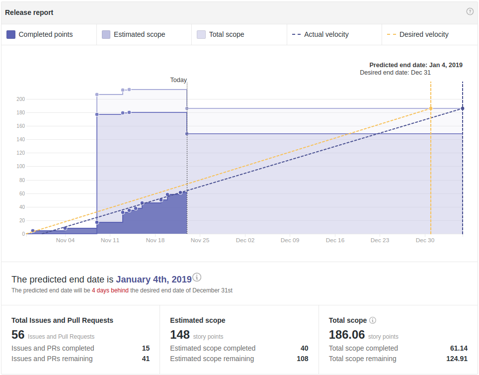

# Wallet Backend Weekly Report 

<p align="right">
  <strong>Week 47</strong>: 2018/11/16 → 2018/11/22
</p>

# Overview



## Remarks

None.

## Milestones

###  Decoupling

```
[======================================================>........................] 56% (37/53)
```

|                 | Start Date | Estimated End Date | Done    | In Progress | New Bugs | Fixed Bugs |
| -----           | -----      | -----              | -----   | -----       | -----    | -----      |
| ![][Decoupling] | 2018-10-22 | 2019-01-04         | [#8](https://github.com/input-output-hk/cardano-wallet/issues/8), [#55](https://github.com/input-output-hk/cardano-wallet/issues/55) | [#15](https://github.com/input-output-hk/cardano-wallet/issues/15), [#30](https://github.com/input-output-hk/cardano-wallet/issues/30)    | -        | -          |

---

###  Address Derivation à la BIP-44

```
[...............................................................................] 0% (0/77)
```

|             | Start Date | Estimated End Date | Done  | In Progress | New Bugs | Fixed Bugs |
| -----       | -----      | -----              | ----- | -----       | -----    | -----      |
| ![][BIP-44] | 2018-11-05 | 2019-01-04         |       | [#28](https://github.com/input-output-hk/cardano-wallet/issues/28), [#33](https://github.com/input-output-hk/cardano-wallet/issues/33)    | -        | -          |

---

### Continuous Integration

```
[===============>...............................................................] 20% (3/15)
```

|         | Start Date | Estimated End Date | Done     | In Progress | New Bugs | Fixed Bugs |
| -----   | -----      | -----              | -----    | -----       | -----    | -----      |
| ![][CI] | 2018-11-19 | 2019-01-04         | [#80](https://github.com/input-output-hk/cardano-wallet/issues/80), [#89](https://github.com/input-output-hk/cardano-wallet/issues/89) | [#65](https://github.com/input-output-hk/cardano-wallet/issues/65)         | -        | [#81](https://github.com/input-output-hk/cardano-wallet/issues/81)        |

---

### Release 2.0.0


```
[===============================================================================] 100% (39/39)
```

|                    | Start Date | Estimated End Date | Done  | In Progress | New Bugs | Fixed Bugs                                       |
| -----              | -----      | -----              | ----- | -----       | -----    | -----                                            |
| ![][Release/2.0.0] | 2018-10-30 | 2018-11-23         | -     | -           | -        | [#72](https://github.com/input-output-hk/cardano-wallet/issues/72), [#82](https://github.com/input-output-hk/cardano-wallet/issues/82), [#92](https://github.com/input-output-hk/cardano-wallet/issues/92), [#93](https://github.com/input-output-hk/cardano-wallet/issues/93), [#94](https://github.com/input-output-hk/cardano-wallet/issues/94), [#95](https://github.com/input-output-hk/cardano-wallet/issues/95), [#96](https://github.com/input-output-hk/cardano-wallet/issues/96), [#97](https://github.com/input-output-hk/cardano-wallet/issues/97), [#98](https://github.com/input-output-hk/cardano-wallet/issues/98), [#99](https://github.com/input-output-hk/cardano-wallet/issues/99) |


# Week Restrospective

## Deliverables

### ![][Decoupling] [#8](https://github.com/input-output-hk/cardano-wallet/issues/8) Implement The Node Management & Monitoring API on the Node's End

> **Context**  
> The wallet currently offers some basic monitoring of the node via the
> `/api/v1/node-info` and `/api/v1/node-settings` endpoints. Underneath, this
> piggy-backs on the fact that the Wallet is ultimately (currently) a node. 

> **Action**  
> We've moved most of the implementation logic related to the API onto the
> node.  The wallet will be able to re-use most of it by using `cardano-sl` as
> a library (as it currently does). This enables for better code-reuse between
> `cardano-sl` and `cardano-wallet`.

### ![][Decoupling] [#55](https://github.com/input-output-hk/cardano-wallet/issues/55) Move & Rename BIP39 Module to `cardano-sl` as `mnemonic`

> **Context**  
> We've moved the wallet into its own repository as a first step towards
> decoupling. Now, `cardano-wallet` uses `cardano-sl` as a peer dependency and
> relies on it for quite a few things. However, a few modules in `cardano-sl`
> also rely on code inside the wallet. This creates some circular dependencies
> between both repositories. One of those dependencies is actually the
> BIP-0039-ish implementation from the `cardano-wallet` used in a few scripts
> and executables currently located on `cardano-sl`.

> **Action**  
> We have reversed this dependency and have made the BIP-0039 implementation
> part of `cardano-sl` as a new `mnemonic` package. In addition, we've relocated
> a few executables and scripts inside this new `mnemonic` package.


### ![][CI] [#80](https://github.com/input-output-hk/cardano-wallet/issues/80) Have Stylish Haskell as Part of the CI Checks

> **Context**
> We use stylish-haskell mostly to "prettify" imports and align a few stuff
> automatically in our editors. However, it can occur that files are committed
> (by mistake) and pushed to the repository without having been prettified.
> This is annoying as it creates useless noises on subsequent PRs.

> **Action**
> stylish-haskell is now ran as part of the CI, alongside hlint and prevent PRs
> from being merged if any stylistic change is detected. 


### ![][CI] [#89](https://github.com/input-output-hk/cardano-wallet/issues/89) Turn Some (Long) Unit Tests Into Nightly Tests


> **Context**
>  Some unit tests are actually stress tests which try to trigger race
>  conditions or concurrency issues. Because of their very nature, those tests
>  need to generate a lot of data and run for a while.  This can be quite
>  painful for our CI and iteration time.

> **Action**
> We've created a nightly job on CI and move some long-running tests as nightly
> tests, reducing the usual CI execution time down to 15 minutes again. 


## Bugs 


### ![][Release/2.0.0] [#72](https://github.com/input-output-hk/cardano-wallet/issues/72) Erroneous Documentation Description

> **Context**  
> The description of the `GET /api/v1/addresses/{address}` endpoint was erroneous.

> **Retrospective**  
> We don't have any clear process of proof-reading the doc regularly. At least,
> upon releases, we should have that as part of a checklist to make sure we
> give it an extra look before cutting the release off.


### ![][CI] [#81](https://github.com/input-output-hk/cardano-wallet/issues/81) Documentation and Weeder Aren't Ran and/or Reported in the CI

> **Context**  
> We've defined jobs in the CI for deploying the most up-to-date documentation
> and for checking dead-code & unused dependencies. One should run after
> merging on the `develop` branch, the other nightly as per CRON schedule. They
> didn't. This happened after some refactoring in the CI configuration which
> introduced some erroneous syntax. 

> **Retrospective**  
> Was indeed an erroneous configuration setting that has been fixed. In
> addition, the CRON job has been removed and changed for a job running on each
> pull request.  It wasn't advised before for we couldn't run jobs in parallel,
> we now can so there's no need for a nightly build anymore.


### ![][Release/2.0.0] [#82](https://github.com/input-output-hk/cardano-wallet/issues/82) Non JSEnd Response for Internal Endpoint '/api/internal/next-update'

> **Context**  
> The API returns responses that are jsend-compliant for all endpoints; e.g.:
>
> ```json
> { 
>     "status": "success",
>     "data": {},
>     "meta": {}
> }
> ```
>
> All responses must be wrapped in a jsend format. The response was returned
> "raw" (so only the "data" content was returned) which causes Daedalus to fail
> at recognizing it.

> **Retrospective**  
> This was unfortunate and inherited from the legacy code. Our testing of so-called
> "internal endpoints" is rather lacunar for they are usually hard functionalities 
> to test and are only used by Daedalus. Yet, we're going to add a unit tests to ensure
> that every response from the API is JSEnd compliant.


### ![][Release/2.0.0] [#96](https://github.com/input-output-hk/cardano-wallet/issues/96) `hasSpendingPassword` is Wrongly Reported After DB Migration

> **Context**  
> When one creates a wallet without a password on the 1.3.1 build and then
> upgrade\migrate to 2.0.0; the resulting wallet has a spending password
> enforced.
> 
> When migrating from an old data-layer, we don't have much information about
> whether there was a password defined on a wallet. So, we use to apply some
> heuristic based on the password last upate timestamp.
> 
> This is rather unreliable and can return misleading metadata for wallets which
> don't have passwords. Because there's no such thing as "no password" (secret
> keys are actually encrypted with an empty passphrase), it is possible to assess
> whether a key was encrypted with a password by trying to decrypt with an empty
> one. If it succeeds, then we can tell for sure that there's no password defined
> for the given key.

> **Retrospective**  
> Migration issues are hard to test and aren't covered in any unit or integration
> tests we have. For the next release, we've reduced migration down to a wallet
> restoration and have ditched away the recovery of metadata from an old wallet.
> This also removes a whole class of bugs like this one.


### ![][Release/2.0.0] [#97](https://github.com/input-output-hk/cardano-wallet/issues/97) Prefiltering Ignores `txId` From Inputs When Create Block Metadata

> **Context**  
> Prefiltering seems to totally ignore txIds from Inputs while creating
> blockMeta. On the other hand it uses TxIns to see which utxos are used. This
> means that if an account has only inputs in a tx, the tx will apear as Failed.
> This can happens when it creates a tx and uses a utxo entirely (no changes). QA
> testing found this bug while trying to empty the wallet, which is a special
> case of the above.

> **Retrospective**  
> Some property tests could have caught that (blockMetaSlotId is never empty).
> We've added a regression integration test covering this particular case later
> on.

### ![][Release/2.0.0] [#98](https://github.com/input-output-hk/cardano-wallet/issues/98) Multithreading at SQlite is not the Greatest

> **Context**  
> The intermediate libraries we use make things slightly worse. We already suffer
> from 2 known issues: 
> 
> - unexpected exceptions because of race conditions
>   (https://github.com/IreneKnapp/direct-sqlite/issues/77). This can make things
>   like this not pattern match
> 
> ```
> Left (Sqlite.SQLConstraintError Sqlite.Unique "tx_metas_outputs.meta_id, tx_metas_outputs.output_index")
> ``` 
> 
> because we get the wrong exception and the node crashes with:
> 
> ```
> StorageFailure (SQLOtherError SQLite3 returned ErrorConstraint while attempting to perform step: not an error)
> cardano-node: StorageFailure (SQLOtherError SQLite3 returned ErrorConstraint while attempting to perform step: not an error)
> ```
> 
> - `withTransaction` is not multithreaded. If 2 threads (which for example
>   restore/sync at the same time) tries to use it, the node may crash. 
> 
> Given the above and despite as cruel as it is, I think we should use our own
> MVars and use mutually exclusive uses of the connection.

> **Retrospective**  
> We've added extra stress unit tests, later turned into nightly tests for
> they're quite long to run. In the end, we rolled up our own synchronization
> mechanism on top of SQLite.


### ![][Release/2.0.0] [#99](https://github.com/input-output-hk/cardano-wallet/issues/99) Fee Calculation Doesn't Account For Extra Inputs or Outputs 

> **Context**  
> After the coin selection algorithm has ran, we adjust this selection and try to
> cover for fee. Fee are variables and depends on:
> 
> 1. A flat rate
> 2. A cost per byte, which varies depending on the number of inputs and outputs
>    of a transaction.
> 
> While covering fee, the algorithm tries to reduce change outputs until they are
> none. If some fee remain, then it select a new input and tries to reduce fee
> and so forth. However, fee aren't recalculated along the way, so we end up not
> covering for enough fee (since the input and output may have grown, fee are
> more expensive).
> 
> To accommodate the current code feels awkward as we've already patched it over
> multiple times during the last past weeks, and it starts looking like a
> monster. Plus, some code seems to live in the wrong abstraction level. I
> suggest a small rewrite of the fee calculation part and some integration tests
> to put an emphasize on what's going on.

> **Retrospective**  
> There are some corner cases that are hard to test in practice: cases where we
> have to increase the number of change outputs. We either need:
> 
> - A BIG change to cause an overflow (but even with all the genesis wallets, we
>   don't have enough funds)
> - A selection that will have no change such that a new one will be created for
>   the change. However, the coin selection tends to always generate a change
>   output.
> 
> In addition, the revised algorithm doesn't try to re-adjust fee after reducing
> the change output. This may indeed reduce the number of inputs or simply,
> reduce the value by a factor big enough that the size of the underlying type
> needed to represent it is smaller. So, senders currently send slightly more fee
> than necessary (talking about hundred of Lovelace). While it doesn't matter
> much now, that could represent a significant amount later.  Therefore, after
> adjusting the selection to cover for fee, we may run some binary search to find
> an optimum between the surplus of change we provide and the fee. This is tricky
> because adding more change may increase the fee, and we do not want to re-run
> the entire adjustment algorithm at this point. So, that's really about doing
> some fiddling trying to recover as much change as we can.


[Decoupling]: https://img.shields.io/badge/-decoupling-%233498db.svg?style=flat-square
[BIP-44]: https://img.shields.io/badge/-BIP--44-%239b59b6.svg?style=flat-square
[CI]: https://img.shields.io/badge/-continuous%20integration-%232ecc71.svg?style=flat-square
[Release/2.0.0]: https://img.shields.io/badge/-release%202.0.0-%2e74c3c.svg?style=flat-square
