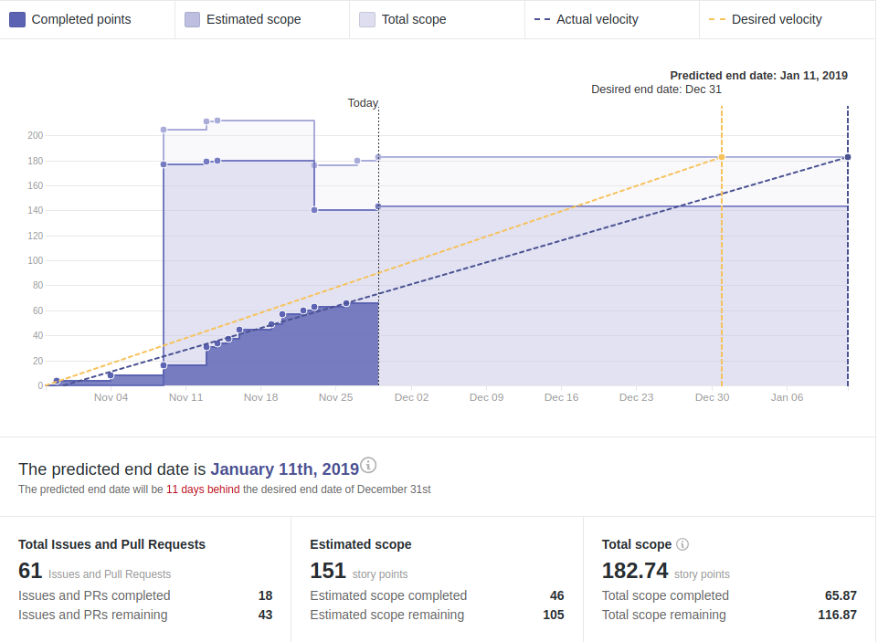

# Wallet Backend Weekly Report 

<p align="right">
  <strong>Week 48</strong>: 23/11/2018 → 29/11/2018
</p>

# Overview



## Remarks

The team was greatly diminished this week (3/8 members) 

- Ante (@akegalj) is on holidays this week
- Johannes (@anviking) is at the Praxis training in Regensburg this week
- Pawel (@paweljakubas) is at the Praxis training in Regensburg this week
- Piotr (@piotr-iohk) is at the Praxis training in Regensburg this week
- Ryan (@uroboros) is at the Praxis training in Regensburg this week

## Milestones

###  Decoupling

```
[======================================================>........................] 56% (37/53)
```

|                 | Start Date | Estimated End Date | Done  | In Progress | New Bugs | Fixed Bugs |
| -----           | -----      | -----              | ----- | -----       | -----    | -----      |
| ![][Decoupling] | 2018-10-22 | 2019-11-04         | -     | [#15](https://github.com/input-output-hk/cardano-wallet/issues/15), [#30](https://github.com/input-output-hk/cardano-wallet/issues/30)    | -        | -          |

---

###  Address Derivation à la BIP-44

```
[==>............................................................................] 4% (3/77)
```

|             | Start Date | Estimated End Date | Done  | In Progress | New Bugs | Fixed Bugs |
| -----       | -----      | -----              | ----- | -----       | -----    | -----      |
| ![][BIP-44] | 2018-11-05 | 2019-11-04         | [#28](https://github.com/input-output-hk/cardano-wallet/issues/28)   | [#33](https://github.com/input-output-hk/cardano-wallet/issues/33)         | -        | -          |

---

### Continuous Integration

```
[=================>.............................................................] 23% (6/26)
```

|         | Start Date | Estimated End Date | Done  | In Progress | New Bugs | Fixed Bugs |
| -----   | -----      | -----              | ----- | -----       | -----    | -----      |
| ![][CI] | 2018-11-19 | 2019-11-04         | -     | [#117](https://github.com/input-output-hk/cardano-wallet/issues/117)        | -        | -          |

---

### Release 2.0.0


```
[===============================================================================] 100% (44/44)
```

|                    | Start Date | Estimated End Date | Done  | In Progress | New Bugs | Fixed Bugs |
| -----              | -----      | -----              | ----- | -----       | -----    | -----      |
| ![][Release/2.0.0] | 2018-10-30 | 2018-11-30         | -     | -           | -        | [#115](https://github.com/input-output-hk/cardano-wallet/issues/115)       |


# Week Restrospective

## Deliverables

### ![][BIP-44] [#28](https://github.com/input-output-hk/cardano-wallet/issues/28) EOS-wallets can be created

> **Context**  
> Part of the work done for defining external wallets was done without clear
> requirements on the underlying derivation scheme. Now that we have a brighter
> idea of what we need, we can adjust existing model types to welcome incoming
> changes.

> **Action**  
> Now we are able to create EOS-wallets from a list of accounts' public keys
> only. We cannot check if these account's public keys correspond to all accounts
> of this EOS-wallet (we even cannot check if they belong to the same
> EOS-wallet), so we don't make any assumptions about it and just work with these
> public keys with no relationship.
>
> Since we don't have a root key for EOS-wallet, we use arbitrary UUIDs to
> identify them
> 
> Address pool gap (max number of unused consecutive addresses allowed) can be
> specified on API-level, otherwise we fallback on a default value of 20 (as
> per BIP-44 specification).


## Bugs 


### ![][Release/2.0.0] [#115](https://github.com/input-output-hk/cardano-wallet/issues/115) Restoration issue hen addresses are discovered prior to accounts. 

> **Context**  
> The code performing the restoration in the old data-layer had a bug where
> addresses discovered for not-yet-discovered accounts would be ignored. This
> would result in incomplete or missing balances at the end of the restoration
> process when the wallet was running the old data-layer   
> (reminder: since 1.4, the new data-layer is ran by default).

> **Retrospective**  
> This could have been rather tricky to find and resolve as it touches only
> specific cases during restoration of the old data-layer. It doesn't affect us
> anymore so-to-speak. Nevertheless, it illustrates our poor testing regarding
> restoration. Stepping back a bit, we had quite a lot of bugs at the edge of the
> release related to restoration and migration of data.


[Decoupling]: https://img.shields.io/badge/-decoupling-%233498db.svg?style=flat-square
[BIP-44]: https://img.shields.io/badge/-BIP--44-%239b59b6.svg?style=flat-square
[CI]: https://img.shields.io/badge/-continuous%20integration-%232ecc71.svg?style=flat-square
[Release/2.0.0]: https://img.shields.io/badge/-release%202.0.0-%2e74c3c.svg?style=flat-square
