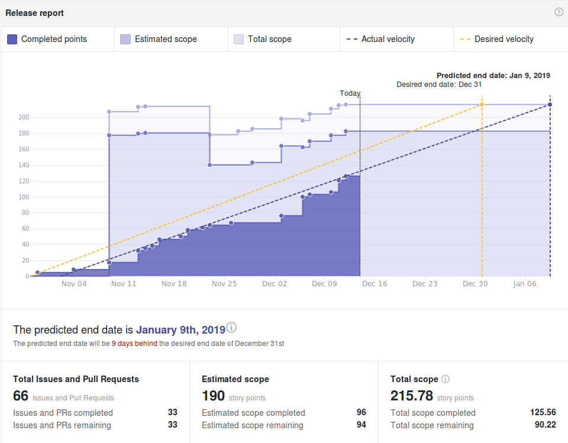

# Wallet Backend Weekly Report 

<p align="right">
  <strong>Week 50</strong>: 2018/12/07 →  2018/12/13
</p>

# Overview



## Remarks

None.

## Milestones

###  Decoupling

```
[======================================================>........................] 70% (55/79)
```

|                 | Start Date | Estimated End Date |
| -----           | -----      | -----              |
| ![][Decoupling] | 2018-10-22 | 2019-01-09         | 


| Epic   | Description                                                                  | Status                  | Value |
| ------ | ----------------------------------------------------                         | --------                | ---   |
| [#109](https://github.com/input-output-hk/cardano-wallet/issues/109)   | We Can Build, Test & Work on Cardano-Wallet in a Dedicated Repository        | Done :heavy_check_mark: | 17/17 |
| [#110](https://github.com/input-output-hk/cardano-wallet/issues/110)   | `cardano-sl` Nodes Can Start an HTTP Server & Provide a Monitoring API       | In Progress :hammer:    | 14/17 |
| [#111](https://github.com/input-output-hk/cardano-wallet/issues/111)   | We Can Consume Blocks From a Node Via The Network Using The Current Protocol | In Progress :hammer:    | 19/40 |
| #???   | We Can Start the Wallet Backend Independently From a Node                    | Not Started :hourglass: | 0/??  |


---

###  Address Derivation à la BIP-44

```
[===================>...........................................................] 26% (14/58)
```

|             | Start Date | Estimated End Date |
| -----       | -----      | -----              |
| ![][BIP-44] | 2018-10-22 | 2019-01-09         |

| Epic   | Description                                              | Status                  | Value |
| ------ | ----------------------------------------------------     | --------                | ---   |
| [#100](https://github.com/input-output-hk/cardano-wallet/issues/100)   | We Can Create E.O.S Wallets                              | Done :heavy_check_mark: | 3/3   |
| [#101](https://github.com/input-output-hk/cardano-wallet/issues/101)   | We Can Sign Transactions Externally for E.O.S. Wallets   | In Progress :hammer:    | 0/8   |
| [#102](https://github.com/input-output-hk/cardano-wallet/issues/102)   | We Can Derive New Sequential Addresses For E.O.S Wallets | In Progress :hammer:    | 3/5   |
| [#103](https://github.com/input-output-hk/cardano-wallet/issues/103)   | We Can Keep Track of E.O.S. Wallets When Applying Blocks | In Progress :hammer:    | 8/15  |
| [#104](https://github.com/input-output-hk/cardano-wallet/issues/104)   | We Can Read, Update, Delete & List E.O.S. Wallets        | Not Started :hourglass: | 0/4   |
| [#105](https://github.com/input-output-hk/cardano-wallet/issues/105)   | We Can Restore E.O.S Wallets                             | Not Started :hourglass: | 0/8   |
| [#106](https://github.com/input-output-hk/cardano-wallet/issues/106)   | We Can Create, Read, Update, Delete & List F.O.S Wallets | In Progress :hammer:    | 0/19  |
| [#107](https://github.com/input-output-hk/cardano-wallet/issues/107)   | We Can Keep Track of F.O.S Wallets When Applying Blocks  | Not Started :hourglass: | 0/5   |
| [#108](https://github.com/input-output-hk/cardano-wallet/issues/108)   | We Can Restore F.O.S Wallets                             | Not Started :hourglass: | 0/5   |


---

### Continuous Integration

```
[================================================>..............................] 61% (19/31)
```

|         | Start Date | Estimated End Date |
| -----   | -----      | -----              |
| ![][CI] | 2018-11-19 | 2019-01-09         |

| Epic   | Description                                                       | Status                  | Value  |
| ------ | ----------------------------------------------------              | --------                | ---    |
| [#112](https://github.com/input-output-hk/cardano-wallet/issues/112)   | We can run and extend integration tests locally and in CI easily  | Done :heavy_check_mark: | 13/13  |
| [#147](https://github.com/input-output-hk/cardano-wallet/issues/147)   | The API is more resilient to the introduction of breaking changes | In Progress :hammer:    | 0 / 12 |

---

### Release 2.0.0

```
[===============================================================================] 100% (52/52)
```

|                    | Start Date | Estimated End Date |
| -----              | -----      | -----              |
| ![][release/1.4.0] | 2018-10-30 | 2018-12-14         |


# Week Retrospective

## Deliverables

### ![][CI] [#117](https://github.com/input-output-hk/cardano-wallet/issues/117) Review structure and implementation of integration tests 

> **Context**  
>
> For a long time now, we have been willing to refactor our integration tests
> such that they will be easier to maintain, but also and in particular, easier
> to comprehend for non-haskellers / beginner haskellers.  A lot of code in
> there suffered from heavy duplication and was overly verbose to the point
> where it wasn't obvious nor even simple to understand what a particular spec
> would do. The reasons behind this "chaos" were plural but mostly due to the
> fact that, integration tests were usually written in a hurry and "maintained"
> by many persons without clear initial design or dialogue.

> **Action**  
>
> We have reviewed entirely the design and tried to stick with something that
> is simple to use. Test scenarios are now presented in a readable format where
> the underlying plumbing is factored out. Tests are also now running in the CI
> after each PR and in a reasonable amount of time, giving us more confidence
> and coverage of the existing code. They are ready to be extended by QA or
> Development to further increase the coverage.


### ![][Decoupling] [#30](https://github.com/input-output-hk/cardano-wallet/issues/30) Start HTTP Server & Implement Monitoring API on The Node's End 

> **Context**  
>
> The wallet currently offers some basic monitoring of the node via the
> `/api/v1/node-info` and `/api/v1/node-settings` API endpoints. Underneath,
> this piggy-backs on some internal state that is maintained by the node. We
> have defined a new similar API to be ran by the node and had to complete the
> implementation of that API such that, the node would serve it through HTTP
> when started. Ideally, we want to cover the same server features than the
> ones offered by the wallet backend already (i.e. TLS symmetric
> authentication, CLI-driven, JSEnd-compliant responses, Hosted Documentation,
> Logging...)

> **Action**  
>
> We've transferred most of the server logic onto the node, and now use it as a
> library from the wallet backend to share code between both implementation and
> favor uniformity.  The node monitoring API is now has complete as the what
> exists on the wallet and could be used as a drop-in replacement by clients.


## Bugs 

### ![][release/1.4.0] [#141](https://github.com/input-output-hk/cardano-wallet/issues/141) Metadata store becomes inconsistent after wallet or account is deleted

> **Context**  
> We store some information related to transactions in the metadata store
> (SQLite). However, when looking up transactions with metadata referring to
> wallets (resp. accounts) we don't know about (anymore), the API fails with a
> not-so-helpful error "WalletNotFound" despite no wallets (resp. accounts)
> being given as part of the query.

> **Retrospective**  
> 
> The final patch and resolution for this issue isn't fully satisfactory. We
> still need to clean-up other tables of the SQLite data-storage. The fact that
> `beam` (the haskell driver library used to talk to SQLite) we use doesn't
> enable us to define foreign keys and cascade operations like delete across
> the DB is worrying. Beside, the "type-safety" gained from using `beam` is
> completely destroyed by the complexity of the underlying code and type-system
> it requires. In the end, I believe plain raw textual SQL queries with
> corresponding tests would be easier to maintain and prove right (or an
> alternative solution)

### ![][release/1.4.0] [#137](https://github.com/input-output-hk/cardano-wallet/issues/137) `--wallet-rebuild-db` doesn't actually rebuild the sqlite database.

> **Context**  
>
> We provide an API flag to cleanup the wallet's state upon starting it. It
> doesn't actually fully cleanup the databases but, only the keystore and
> acid-state database. SQLite remains untouched.

> **Retrospective**  
> 
> I wonder how / why we haven't caught this before. The flag is mostly used for
> testing and as a convenient way to restart the wallet backend on a cleaned
> state; therefore the impact is quite low. Yet, it demonstrates the lack of
> testing of the overall CLI.  This is now partly covered by the existing
> integration tests but could be done to a greater extend.

### ![][CI] [#143](https://github.com/input-output-hk/cardano-wallet/issues/143)  Failing integration test on UTxO statistics

> **Context**  
>
> While implementing the new integration tests and translating our previous 
> test scenarios to their new format, one scenario failed an was left aside
> to be tackled later.

> **Retrospective**  
> 
> There was an error one function asserting the result of the aforementioned
> test.  It was therefore a false alarm and has been fixed. Each integration
> test is now set to active and all integration tests pass. 


[Decoupling]: https://img.shields.io/badge/-decoupling-%233498db.svg?style=flat-square
[BIP-44]: https://img.shields.io/badge/-BIP--44-%239b59b6.svg?style=flat-square
[CI]: https://img.shields.io/badge/-continuous%20integration-%232ecc71.svg?style=flat-square
[Release/1.4.0]: https://img.shields.io/badge/-release%202.0.0-%2e74c3c.svg?style=flat-square
