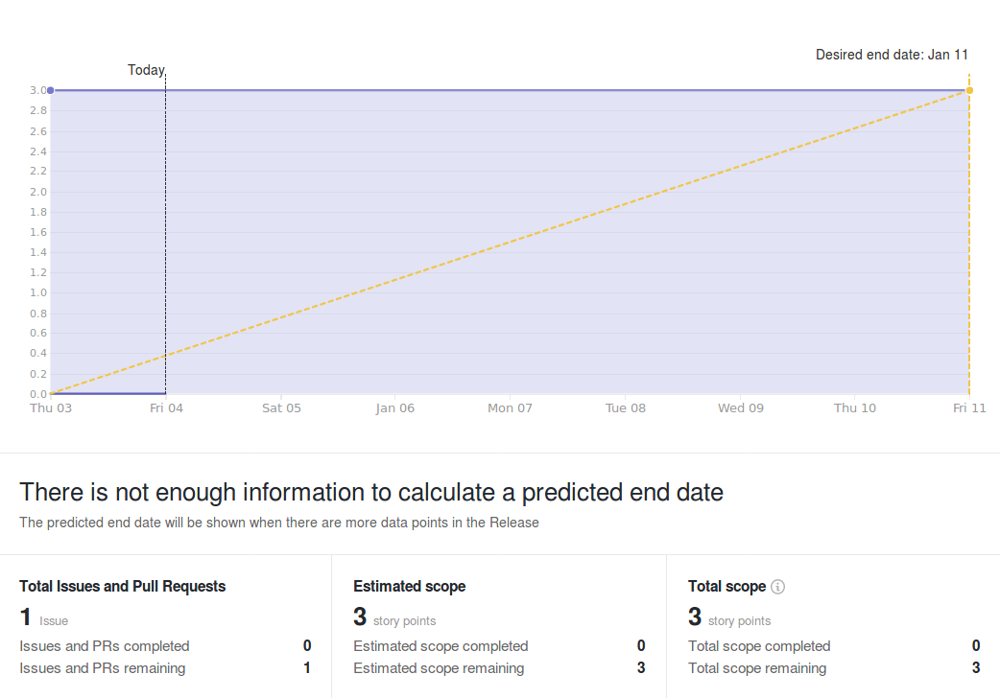
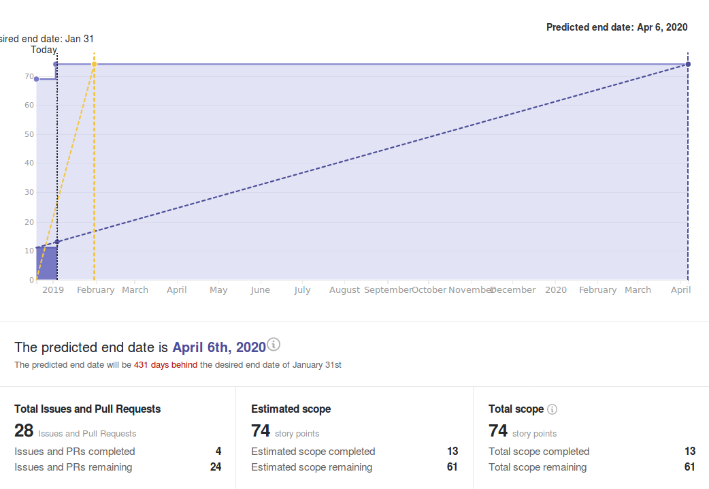

# Wallet Backend Weekly Report 

<p align="right">
  <strong>Week 01</strong>: 2018/12/28 →  2019/01/03
</p>

# Overview

## 1.4.1 New Data-Layer (HotFix)



## 1.6 Address Derivation à la BIP-44



## 1.x Wallet Evolution


# Remarks

- Most of the team missing from the 27th to 2nd (New Year Eve)
- We've moved one epic from the `Decoupling` Milestone to `Continuous integration` as it reflects more accurately its context and scope.


# Milestones

###  Decoupling

```
[==============================================>................................] 60% (36/60)
```

|                 | Start Date | Estimated End Date |
| -----           | -----      | -----              |
| ![][Decoupling] | 2018-10-22 | 2019-01-04         | 


| Epic                                                                 | Description                                                                  | Status                  | Value |
| ------                                                               | ----------------------------------------------------                         | --------                | ---   |
| [#110](https://github.com/input-output-hk/cardano-wallet/issues/110) | `cardano-sl` Nodes Can Start an HTTP Server & Provide a Monitoring API       | In Progress :hammer:    | 14/17 |
| [#111](https://github.com/input-output-hk/cardano-wallet/issues/111) | We Can Consume Blocks From a Node Via The Network Using The Current Protocol | In Progress :hammer:    | 19/40 |


---

###  Address Derivation à la BIP-44

```
[================>..............................................................] 22% (16/72)
```

|             | Start Date | Estimated End Date |
| -----       | -----      | -----              |
| ![][BIP-44] | 2018-10-22 | \-                 |

| Epic                                                                 | Description                                              | Status                  | Value |
| ------                                                               | ----------------------------------------------------     | --------                | ---   |
| [#100](https://github.com/input-output-hk/cardano-wallet/issues/100) | We Can Create E.O.S Wallets                              | Done :heavy_check_mark: | 3/3   |
| [#101](https://github.com/input-output-hk/cardano-wallet/issues/101) | We Can Sign Transactions Externally for E.O.S. Wallets   | In Progress :hammer:    | 0/8   |
| [#102](https://github.com/input-output-hk/cardano-wallet/issues/102) | We Can Derive New Sequential Addresses For E.O.S Wallets | In Progress :hammer:    | 3/5   |
| [#103](https://github.com/input-output-hk/cardano-wallet/issues/103) | We Can Keep Track of E.O.S. Wallets When Applying Blocks | In Progress :hammer:    | 8/15  |
| [#104](https://github.com/input-output-hk/cardano-wallet/issues/104) | We Can Read, Update, Delete & List E.O.S. Wallets        | Not Started :hourglass: | 0/4   |
| [#105](https://github.com/input-output-hk/cardano-wallet/issues/105) | We Can Restore E.O.S Wallets                             | Not Started :hourglass: | 0/8   |
| [#106](https://github.com/input-output-hk/cardano-wallet/issues/106) | We Can Create, Read, Update, Delete & List F.O.S Wallets | In Progress :hammer:    | 2/19  |
| [#107](https://github.com/input-output-hk/cardano-wallet/issues/107) | We Can Keep Track of F.O.S Wallets When Applying Blocks  | Not Started :hourglass: | 0/5   |
| [#108](https://github.com/input-output-hk/cardano-wallet/issues/108) | We Can Restore F.O.S Wallets                             | Not Started :hourglass: | 0/5   |


---

### Continuous Integration

```
[====================================================>..........................] 66% (45/68)
```

|         | Start Date | Estimated End Date |
| -----   | -----      | -----              |
| ![][CI] | 2018-11-19 | 2019-01-11         |

| Epic                                                                 | Description                                                           | Status                  | Value |
| ------                                                               | ----------------------------------------------------                  | --------                | ---   |
| [#109](https://github.com/input-output-hk/cardano-wallet/issues/109) | We Can Build, Test & Work on Cardano-Wallet in a Dedicated Repository | Done :heavy_check_mark: | 17/17 |
| [#112](https://github.com/input-output-hk/cardano-wallet/issues/112) | We can run and extend integration tests locally and in CI easily      | Done :heavy_check_mark: | 13/13 |
| [#147](https://github.com/input-output-hk/cardano-wallet/issues/147) | The API is more resilient to the introduction of breaking changes     | In Progress :hammer:    | 7/17  |
| [#200](https://github.com/input-output-hk/cardano-wallet/issues/200) | Bug Fixing                                                            | In Progress :hammer:    | 8/21  |

---

# Week Retrospective

## Deliverables

### ![][BIP-44] [#41](https://github.com/input-output-hk/cardano-wallet/issues/41) BIP-44 Utils Part II: Hardened Derivations 

> **Context**  
> This is finalizing the work started in
> [#31](https://github.com/input-output-hk/cardano-wallet/issues/31) but
> including private key derivations and operations this time.

> **Retrospective**  
> The problem in itself was rather simple but we ran into unforeseen issues
> with bugs in our peer dependencies. Fortunately, our newly introduced tests
> for this particular feature were able to catch that. After fixing the library
> upstream, we were able to finalize the task.


## Bugs

None :tada:


[Decoupling]: https://img.shields.io/badge/-decoupling-%233498db.svg?style=flat-square
[BIP-44]: https://img.shields.io/badge/-BIP--44-%239b59b6.svg?style=flat-square
[CI]: https://img.shields.io/badge/-continuous%20integration-%232ecc71.svg?style=flat-square
[Release/1.4.0]: https://img.shields.io/badge/-release%202.0.0-%2e74c3c.svg?style=flat-square
