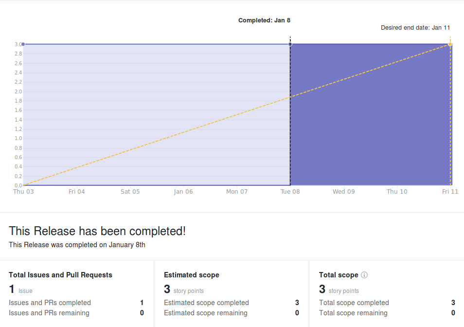
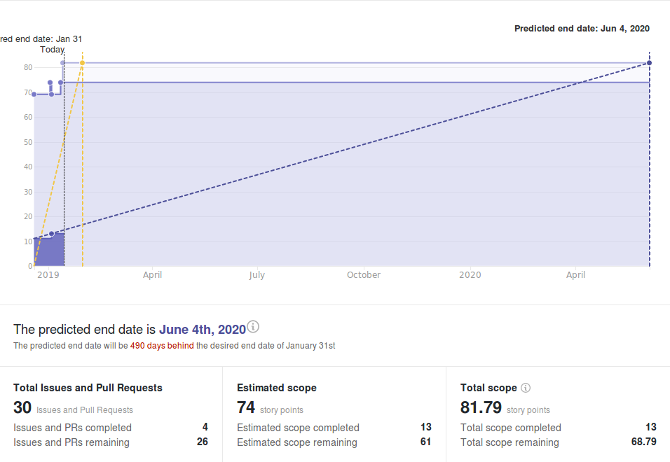
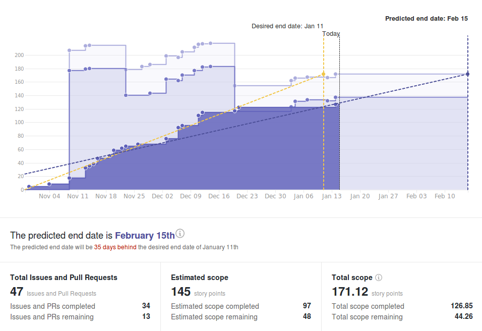

# Wallet Backend Weekly Report 

<p align="right">
  <strong>Week 02</strong>: 2019/01/04 →  2019/01/10
</p>

# Overview

## 1.4.1 New Data-Layer (HotFix)



## 1.6 Address Derivation à la BIP-44



## 1.x Wallet Evolution




# Remarks

- The team is reaching the final stage for the first phase of the decoupling.
  Code is now under QA and being heavily tested to make sure the new
  connectivity with the Haskell node works correctly.

- Derivation à la BIP-44 is also making progress under the hood which will
  hopefully soon be reflected in the issue tracker. We've completed most of the
  refactoring that was necessary to introduce this new set of features and started
  to experiment and compare with Icarus wallets. 

- Some tickets we hopped to close this week failed to pass QA and the test
  suite we put in place. Reason being that, when comparing our implementation
  of the new address derivation with the one present on the Rust side
  (Icarus/Yoroi), we discovered discrepencies and identified needs for the
  toolset in `cardano-crypto` to be extended. We are now waiting for the updates
  and will continue with testing once we have the necessary tools.


# Milestones

###  Decoupling

```
[==============================================>................................] 60% (36/60)
```

|                 | Start Date | Estimated End Date |
| -----           | -----      | -----              |
| ![][Decoupling] | 2018-10-22 | 2019-01-18         | 


| Epic                                                                 | Description                                                                  | Status                  | Value |
| ------                                                               | ----------------------------------------------------                         | --------                | ---   |
| [#110](https://github.com/input-output-hk/cardano-wallet/issues/110) | `cardano-sl` Nodes Can Start an HTTP Server & Provide a Monitoring API       | In Progress :hammer:    | 14/17 |
| [#111](https://github.com/input-output-hk/cardano-wallet/issues/111) | We Can Consume Blocks From a Node Via The Network Using The Current Protocol | In Progress :hammer:    | 19/40 |


---

###  Address Derivation à la BIP-44

```
[================>..............................................................] 21% (16/77)
```

|             | Start Date | Estimated End Date |
| -----       | -----      | -----              |
| ![][BIP-44] | 2018-10-22 | 2019-01-31         |

| Epic                                                                 | Description                                              | Status                  | Value |
| ------                                                               | ----------------------------------------------------     | --------                | ---   |
| [#100](https://github.com/input-output-hk/cardano-wallet/issues/100) | We Can Create E.O.S Wallets                              | Done :heavy_check_mark: | 3/3   |
| [#101](https://github.com/input-output-hk/cardano-wallet/issues/101) | We Can Sign Transactions Externally for E.O.S. Wallets   | In Progress :hammer:    | 0/8   |
| [#102](https://github.com/input-output-hk/cardano-wallet/issues/102) | We Can Derive New Sequential Addresses For E.O.S Wallets | In Progress :hammer:    | 3/10  |
| [#103](https://github.com/input-output-hk/cardano-wallet/issues/103) | We Can Keep Track of E.O.S. Wallets When Applying Blocks | In Progress :hammer:    | 8/15  |
| [#104](https://github.com/input-output-hk/cardano-wallet/issues/104) | We Can Read, Update, Delete & List E.O.S. Wallets        | Not Started :hourglass: | 0/4   |
| [#105](https://github.com/input-output-hk/cardano-wallet/issues/105) | We Can Restore E.O.S Wallets                             | Not Started :hourglass: | 0/8   |
| [#106](https://github.com/input-output-hk/cardano-wallet/issues/106) | We Can Create, Read, Update, Delete & List F.O.S Wallets | In Progress :hammer:    | 2/19  |
| [#107](https://github.com/input-output-hk/cardano-wallet/issues/107) | We Can Keep Track of F.O.S Wallets When Applying Blocks  | Not Started :hourglass: | 0/5   |
| [#108](https://github.com/input-output-hk/cardano-wallet/issues/108) | We Can Restore F.O.S Wallets                             | Not Started :hourglass: | 0/5   |


---

### Continuous Integration

```
[=====================================================>.........................] 68% (50/74)
```

|         | Start Date | Estimated End Date |
| -----   | -----      | -----              |
| ![][CI] | 2018-11-19 | 2019-01-31         |

| Epic                                                                 | Description                                                           | Status                  | Value |
| ------                                                               | ----------------------------------------------------                  | --------                | ---   |
| [#109](https://github.com/input-output-hk/cardano-wallet/issues/109) | We Can Build, Test & Work on Cardano-Wallet in a Dedicated Repository | Done :heavy_check_mark: | 17/17 |
| [#112](https://github.com/input-output-hk/cardano-wallet/issues/112) | We can run and extend integration tests locally and in CI easily      | Done :heavy_check_mark: | 13/13 |
| [#147](https://github.com/input-output-hk/cardano-wallet/issues/147) | The API is more resilient to the introduction of breaking changes     | In Progress :hammer:    | 9/17  |
| [#200](https://github.com/input-output-hk/cardano-wallet/issues/200) | Bug Fixing                                                            | In Progress :hammer:    | 11/27 |

---

# Week Retrospective

## Deliverables

### ![][BIP-44] [#41](https://github.com/input-output-hk/cardano-wallet/issues/41) BIP-44 Utils Part II: Hardened Derivations 

> **Context**  
> This is finalizing the work started in
> [#31](https://github.com/input-output-hk/cardano-wallet/issues/31) but
> including private key derivations and operations this time.

> **Retrospective**  
> The problem in itself was rather simple but we ran into unforeseen issues
> with bugs in our peer dependencies. Fortunately, our newly introduced tests
> for this particular feature were able to catch that. After fixing the library
> upstream, we were able to finalize the task.


#### ![][CI] [#79](https://github.com/input-output-hk/cardano-wallet/issues/79) Control that each API response returns a JSEnd compliant response

> **Context**  
> As a follow-up for #77, it's clear that we aren't enforcing any particular
> response format for the API. Therefore, it is possible to simply declare an
> API response that would be inconsistent with others. This can be controlled
> quite easily through testing using the API types constructed with Servant.

> **Retrospective**  
> We've produced calls for a QuickCheck property over all response types of the
> API. Servant's type-level programming allows us to do this for successful
> responses, but it won't suffice for error or failure responses. This is already
> a good step towards the right direction and strengthen the contract between the
> API documentation and its actual implementation.


## Bugs

### ![][Release/1.4.1] [#191](https://github.com/input-output-hk/cardano-wallet/issues/191)  Fee sanity check is triggered more than it should 

> **Context**  
> When solving CSL-2526, we introduced an extra sanity check to make the API
> fails if it was to generate a transaction with too many fees (to prevent us
> from creating illed transactions because of a programming error in the coin
> selection / fee calculation).  
> Yet, it turns out this check is a bit too strict / wrong for it compare
> transaction fees to an absolute value. Therefore, some transactions with many
> inputs and, actually expensive fees, fail to be created despite being totally
> valid.

> **Action**  
> Turns ou that our testing scenarios for CoinSelection weren't catching any of
> this but still, were making us believe they did (the fee sanity checkers were
> defined and required in the tests themselves but were never needed to run the
> tests).  
> This is a pretty big issue in terms of QA which may be also happening in
> other parts of the testing suite. Part of the work we started with QA
> includes reviewing our software requirements and, making sure that they're
> all tested properly. These are measures to prevent this kind of incident from
> happening again.

### ![][CI] [#205](https://github.com/input-output-hk/cardano-wallet/issues/205) Swagger JSON-Schema validation test doesn't provide failure-reason

> **Context**  
> We test the validity of our JSON encodings against the swagger schema using a
> property test. Yet, upon failure, the cause of failures aren't displayed which
> makes debugging hard. 

> **Action**  
> We've made just to make our testing failures more verbose to help faster
> debugging in case of issues making the resolution of such mistakes quicker.
> Generally speaking, testing could should be engineered in such way that, upon
> failures, developers are given enough information to pinpoint and fix the
> source of the failure. 

[Decoupling]: https://img.shields.io/badge/-decoupling-%233498db.svg?style=flat-square
[BIP-44]: https://img.shields.io/badge/-BIP--44-%239b59b6.svg?style=flat-square
[CI]: https://img.shields.io/badge/-continuous%20integration-%232ecc71.svg?style=flat-square
[Release/1.4.1]: https://img.shields.io/badge/-release%201.4.1-%2e74c3c.svg?style=flat-square
