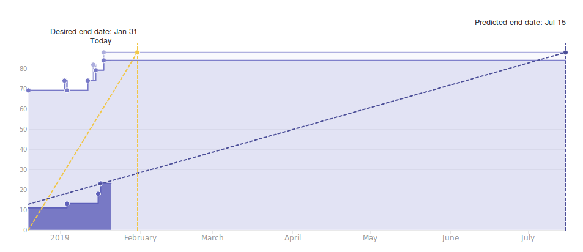

# Wallet Backend Weekly Report 

<p align="right">
  <strong>Week 03</strong>: 2019/01/11 →  2019/01/17
</p>

# Overview

## Summary

Good progresses in each direction have been made this week. The wallet
decoupling is approaching its end and most of the remaining bits are now under
reviews. Yet, priority has been placed on BIP-44 recently. The team focuses on
getting the first testable capabilities for externally owned wallets done.
This would allow for comparing Yoroi and the Cardano wallet backend
side-by-side. This week, the team was already able to compare addresses created
from one with addresses created from the other. Both Haskell & Rust
implementations for address derivation match!


## 1.6 Address Derivation à la BIP-44



## 1.x Wallet Evolution


# Milestones

###  Decoupling

```
[==============================================>................................] 60% (36/60)
```

|                 | Start Date | Estimated End Date |
| -----           | -----      | -----              |
| ![][Decoupling] | 2018-10-22 | 2019-01-31         | 


| Epic                                                                 | Description                                                                  | Status                  | Value |
| ------                                                               | ----------------------------------------------------                         | --------                | ---   |
| [#110](https://github.com/input-output-hk/cardano-wallet/issues/110) | `cardano-sl` Nodes Can Start an HTTP Server & Provide a Monitoring API       | In Progress :hammer:    | 14/17 |
| [#111](https://github.com/input-output-hk/cardano-wallet/issues/111) | We Can Consume Blocks From a Node Via The Network Using The Current Protocol | In Progress :hammer:    | 19/40 |


---

###  Address Derivation à la BIP-44

```
[==========================>....................................................] 34% (26/77)
```

|             | Start Date | Estimated End Date |
| -----       | -----      | -----              |
| ![][BIP-44] | 2018-10-22 | 2019-01-31         |

| Epic                                                                 | Description                                              | Status                  | Value |
| ------                                                               | ----------------------------------------------------     | --------                | ---   |
| [#100](https://github.com/input-output-hk/cardano-wallet/issues/100) | We Can Create E.O.S Wallets                              | Done :heavy_check_mark: | 3/3   |
| [#101](https://github.com/input-output-hk/cardano-wallet/issues/101) | We Can Sign Transactions Externally for E.O.S. Wallets   | In Progress :hammer:    | 0/8   |
| [#102](https://github.com/input-output-hk/cardano-wallet/issues/102) | We Can Derive New Sequential Addresses For E.O.S Wallets | In Progress :hammer:    | 8/10  |
| [#103](https://github.com/input-output-hk/cardano-wallet/issues/103) | We Can Keep Track of E.O.S. Wallets When Applying Blocks | In Progress :hammer:    | 13/15 |
| [#104](https://github.com/input-output-hk/cardano-wallet/issues/104) | We Can Read, Update, Delete & List E.O.S. Wallets        | Not Started :hourglass: | 0/4   |
| [#105](https://github.com/input-output-hk/cardano-wallet/issues/105) | We Can Restore E.O.S Wallets                             | Not Started :hourglass: | 0/8   |
| [#106](https://github.com/input-output-hk/cardano-wallet/issues/106) | We Can Create, Read, Update, Delete & List F.O.S Wallets | In Progress :hammer:    | 2/19  |
| [#107](https://github.com/input-output-hk/cardano-wallet/issues/107) | We Can Keep Track of F.O.S Wallets When Applying Blocks  | Not Started :hourglass: | 0/5   |
| [#108](https://github.com/input-output-hk/cardano-wallet/issues/108) | We Can Restore F.O.S Wallets                             | Not Started :hourglass: | 0/5   |


---

### Continuous Integration

```
[=====================================================>.........................] 68% (50/74)
```

|         | Start Date | Estimated End Date |
| -----   | -----      | -----              |
| ![][CI] | 2018-11-19 | 2019-01-31         |

| Epic                                                                 | Description                                                           | Status                  | Value |
| ------                                                               | ----------------------------------------------------                  | --------                | ---   |
| [#109](https://github.com/input-output-hk/cardano-wallet/issues/109) | We Can Build, Test & Work on Cardano-Wallet in a Dedicated Repository | Done :heavy_check_mark: | 17/17 |
| [#112](https://github.com/input-output-hk/cardano-wallet/issues/112) | We can run and extend integration tests locally and in CI easily      | Done :heavy_check_mark: | 13/13 |
| [#147](https://github.com/input-output-hk/cardano-wallet/issues/147) | The API is more resilient to the introduction of breaking changes     | In Progress :hammer:    | 9/17  |
| [#200](https://github.com/input-output-hk/cardano-wallet/issues/200) | Bug Fixing                                                            | In Progress :hammer:    | 11/27 |

---

# Week Retrospective

## Deliverables

### ![][BIP-44] [#34](https://github.com/input-output-hk/cardano-wallet/issues/34) Review Prefiltering

> **Context**  
> Introducing a new derivation scheme in the current prefiltering code was
> quite challenging. In order to do that, we first had to review the design 
> of the underlying module to reduce the complexity gained from bug fixes and
> rapid changes. 

> **Action**  
> We've entirely redesigned the prefiltering code making sure in the meantime
> to have it ready to welcome both the existing and the new address derivation
> scheme to recognize _ours_ addresses in a block. Note that this has also
> impacts on the restoration code which will benefit from this redesign and
> refactorings.

### ![][BIP-44] [#195](https://github.com/input-output-hk/cardano-wallet/issues/195) Golden Tests for BIP-44 Derivation 

> **Context**  
> One of our main objectives with implementing the address derivation à la
> BIP-44 is to make the backend compatible and interoperable between Icarus and
> Daedalus.  Therefore, we needed to add golden tests verifying (at least for a
> few addresses) that we would yield the same addresses from same mnemonic
> words and derivation path.

> **Action**  
> While doing so, we've discovered that functions in `cardano-crypto` weren't
> sufficient to achieve our goal. Turns out that Yoroi / Icarus' style
> addresses also using a different seed generation method (more aligned with
> the BIP-32 specs than the existing implementation).  After fixing this, we
> were able to produce identical Cardano addresses, regardless if produced from
> `cardano-cli` in Rust or from `cardano-wallet` in Haskell :tada: !

[Decoupling]: https://img.shields.io/badge/-decoupling-%233498db.svg?style=flat-square
[BIP-44]: https://img.shields.io/badge/-BIP--44-%239b59b6.svg?style=flat-square
[CI]: https://img.shields.io/badge/-continuous%20integration-%232ecc71.svg?style=flat-square
