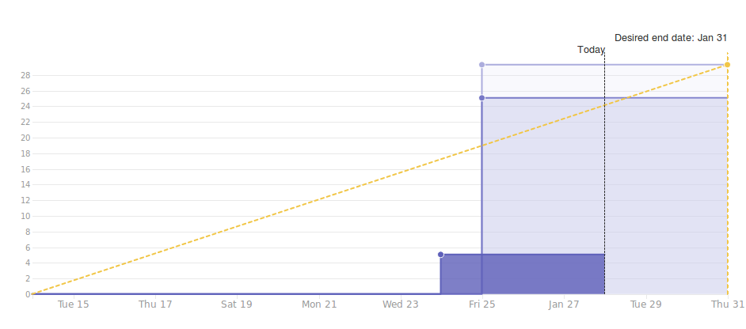
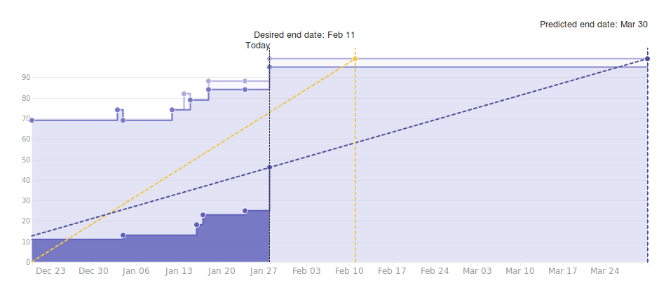
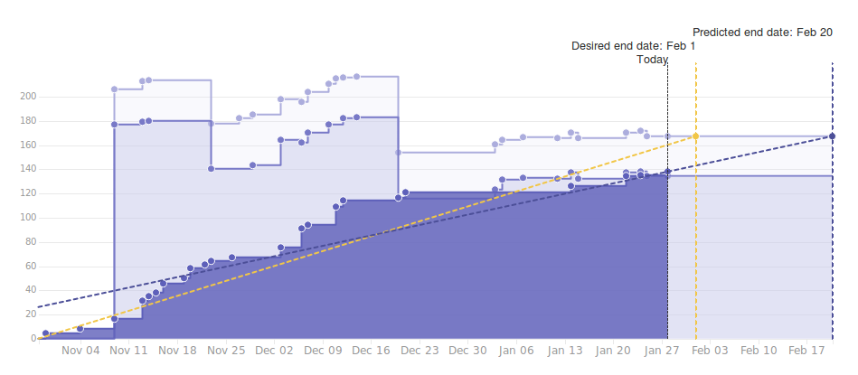

# Wallet Backend Weekly Report 

<p align="right">
  <strong>Week 04</strong>: 2019/01/18 →  2019/01/24
</p>

# Overview

## Summary

The team has started integrating the final bits on the node decoupling as well
as cleaning up the implementation from old artifacts.  Note that, decoupling
won't be fully enabled by default but under some experimental flags in the next
releases. Since this is not observable for the users and brings no immediate
business value for the upcoming releases (but is a necessary step in order to
transition from the current node to the new Haskell or Rust node), we will
simply turn it off by default. Meanwhile, the effort continues on BIP-44, which
approaches full support for externally owned wallet support (a direct follow-up
from that will be the support for hardware devices like Ledger).  Finally, we
are also wrapping up and polishing the state of `develop` on cardano-sl for the
upcoming 1.5 release. 

## 1.5 The Great Cleanup

 

## 1.6 Address Derivation à la BIP-44



## 1.6 Wallet Evolution



# Milestones

### Release 1.5-RC

```
[===============>...............................................................] 20% (5/25)
```

|         | Start Date | Estimated End Date |
| -----   | -----      | -----              |
| ![][1.5-rc] | 2019-01-16 | 2019-01-31         |


###  Decoupling

```
[===============================================>...............................] 63% (39/62)
```

|                 | Start Date | Estimated End Date |
| -----           | -----      | -----              |
| ![][Decoupling] | 2018-10-22 | 2019-01-31         | 


| Epic                                                                 | Description                                                                  | Status                  | Value |
| ------                                                               | ----------------------------------------------------                         | --------                | ---   |
| [#110](https://github.com/input-output-hk/cardano-wallet/issues/110) | `cardano-sl` Nodes Can Start an HTTP Server & Provide a Monitoring API       | In Progress :hammer:    | 14/17 |
| [#111](https://github.com/input-output-hk/cardano-wallet/issues/111) | We Can Consume Blocks From a Node Via The Network Using The Current Protocol | In Progress :hammer:    | 19/40 |


---

###  Address Derivation à la BIP-44

```
[=======================================>.......................................] 50% (49/100)
```

|             | Start Date | Estimated End Date |
| -----       | -----      | -----              |
| ![][BIP-44] | 2018-10-22 | 2019-01-31         |

| Epic                                                                 | Description                                              | Status                         | Value |
| ------                                                               | ----------------------------------------------------     | --------                       | ---   |
| [#100](https://github.com/input-output-hk/cardano-wallet/issues/100) | We Can Create E.O.S Wallets                              | In Progress :hammer:           | 5/15  |
| [#101](https://github.com/input-output-hk/cardano-wallet/issues/101) | We Can Sign Transactions Externally for E.O.S. Wallets   | In Progress :hammer:           | 7/12  |
| [#102](https://github.com/input-output-hk/cardano-wallet/issues/102) | We Can Derive New Sequential Addresses For E.O.S Wallets | In Progress :hammer:           | 8/10  |
| [#103](https://github.com/input-output-hk/cardano-wallet/issues/103) | We Can Keep Track of E.O.S. Wallets When Applying Blocks | In Progress :hammer:           | 15/20 |
| [#104](https://github.com/input-output-hk/cardano-wallet/issues/104) | We Can Read, Update, Delete & List E.O.S. Wallets        | Not Started :hourglass:        | 0/4   |
| [#105](https://github.com/input-output-hk/cardano-wallet/issues/105) | We Can Restore E.O.S Wallets                             | Not Started :hourglass:        | 0/10  |
| [#106](https://github.com/input-output-hk/cardano-wallet/issues/106) | We Can Create, Read, Update, Delete & List F.O.S Wallets | In Progress :hammer:           | 9/19  |
| [#107](https://github.com/input-output-hk/cardano-wallet/issues/107) | We Can Keep Track of F.O.S Wallets When Applying Blocks  | Not Started :heavy_check_mark: | 5/5   |
| [#108](https://github.com/input-output-hk/cardano-wallet/issues/108) | We Can Restore F.O.S Wallets                             | Not Started :hourglass:        | 0/5   |


---

### Continuous Integration

```
[===================================================================>...........] 86% (59/69)
```

|         | Start Date | Estimated End Date |
| -----   | -----      | -----              |
| ![][CI] | 2018-11-19 | 2019-01-31         |

| Epic                                                                 | Description                                                           | Status                  | Value |
| ------                                                               | ----------------------------------------------------                  | --------                | ---   |
| [#109](https://github.com/input-output-hk/cardano-wallet/issues/109) | We Can Build, Test & Work on Cardano-Wallet in a Dedicated Repository | Done :heavy_check_mark: | 17/17 |
| [#112](https://github.com/input-output-hk/cardano-wallet/issues/112) | We can run and extend integration tests locally and in CI easily      | Done :heavy_check_mark: | 13/13 |
| [#147](https://github.com/input-output-hk/cardano-wallet/issues/147) | The API is more resilient to the introduction of breaking changes     | Done :heavy_check_mark: | 17/17 |
| [#200](https://github.com/input-output-hk/cardano-wallet/issues/200) | Bug Fixing                                                            | In Progress :hammer:    | 12/22 |

---

# Week Retrospective

## Deliverables

### ![][BIP-44] [#235](https://github.com/input-output-hk/cardano-wallet/issues/235) Remove WIP Paths and expose them in the API

> **Context**  
> Quite some work related to externally owned wallets happened in some WIP modules and API paths to keep it from interacting too early on with the development branch.

> **Action**
> We have exposed those endpoints and related functionalities through the API, next to the others.


### ![][CI] [#252](https://github.com/input-output-hk/cardano-wallet/issues/252) Doc isn't build nor uploaded from the CI anymore 

> **Context**  
> The CI has a special "documentation" job. When code get merged into `develop`, we build the corresponding API documentation and publish it to a branch on our development repository. 
> However, this job was "allowed to fail" in some cases (e.g. when there's no new API documentation to publish) which caused us to be slightly less regarding to failures happening 
> in that one. Yet, we noticed that the documentation wasn't uploaded as it should upon successful merges which contained API documentation.

> **Action**  
> We fixed the build and publishing script for documentation, and made sure that the corresponding CI job will now only fail if there's an actual failure. Failing to publish the documentation
> because it hasn't changed is now handled properly as a valid path for the job.


### ![][CI] [#172](https://github.com/input-output-hk/cardano-wallet/issues/172)  Integration Tests Coverage: Wallets (Part 1) 

> **Context**  
> We've started to give more structure to our testing, and to document our application capabilities (making sure that each capability is actually covered by one or several corresponding tests).

> **Action**  
> As a result of this first iteration, we've listed all the external capabilities one may expect from the wallet API and started testing each one of them. 


### ![][1.5-rc] [#230](https://github.com/input-output-hk/cardano-wallet/issues/230) Migration from 1.4.x to 1.5.0 fails

> **Context**  
> While preparing for 1.5.0 release and testing a few things that aren't automatically tested in our CI, we discovered that DB from 1.4.x weren't 100% compatible with DB from 1.5.0.

> **Action**  
> We realized some work-in-progress endpoints and data-types had wrongly made it to the `develop` branch and removed them. These caused the database migration to fail because we hadn't
> defined any migration for them (yet).


[Decoupling]: https://img.shields.io/badge/-decoupling-%233498db.svg?style=flat-square
[BIP-44]: https://img.shields.io/badge/-BIP--44-%239b59b6.svg?style=flat-square
[CI]: https://img.shields.io/badge/-continuous%20integration-%232ecc71.svg?style=flat-square
[1.5-rc]: https://img.shields.io/badge/-1.5--rc-%231db7ff.svg?style=flat-square
