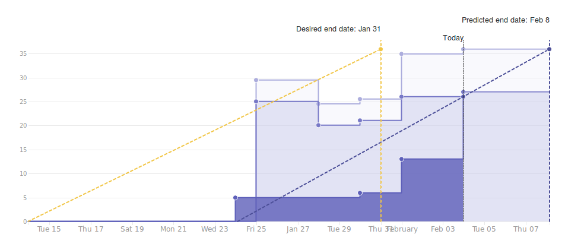
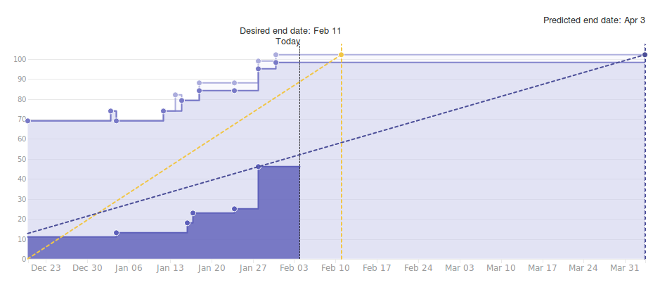
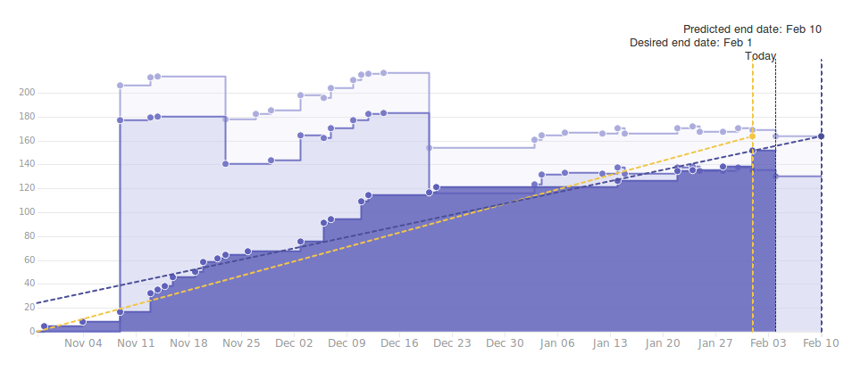

# Wallet Backend Weekly Report 

<p align="right">
  <strong>Week 05</strong>: 2019/01/25 →  2019/01/31
</p>

# Overview

## Summary

This week, the team prepared for the upcoming 1.5 release, making sure it
contains all the documentation it could contain and, adding a few extra test
scenarios reflecting on users' use-cases. Meanwhile, we also decided to put the
work on decoupling on-hold after having finalized a prototype "lighweight"
wallet using the network layer to retrieve blocks from a trusted node. This
prototype doesn't actually persist blocks (and therefore, isn't able to handle
rollbacks) and, do not persist block headers on disk (meaning that it is not
interruptible). Still, it draws the baseline of a decoupled lightweight wallet
which clearly shows where the remaining coupling areas are and how to remove
them.


## 1.5 The Great Cleanup

 

## 1.6 Address Derivation à la BIP-44



## 1.6 Wallet Evolution



# Milestones


### Release 1.5-RC

```
[===================================================>...........................] 52% (26/40)
```


###  Decoupling

```
[===============================================================================] 100% (60/60)
```


| Epic                                                                 | Description                                                                  | Status                  | Value |
| ------                                                               | ----------------------------------------------------                         | --------                | ---   |
| [#110](https://github.com/input-output-hk/cardano-wallet/issues/110) | `cardano-sl` Nodes Can Start an HTTP Server & Provide a Monitoring API       | Done :heavy_check_mark: | 17/17 |
| [#111](https://github.com/input-output-hk/cardano-wallet/issues/111) | We Can Consume Blocks From a Node Via The Network Using The Current Protocol | Done :heavy_check_mark: | 40/40 |


---

###  Address Derivation à la BIP-44

```
[=======================================>.......................................] 50% (49/100)
```

| Epic                                                                 | Description                                              | Status                         | Value |
| ------                                                               | ----------------------------------------------------     | --------                       | ---   |
| [#100](https://github.com/input-output-hk/cardano-wallet/issues/100) | We Can Create E.O.S Wallets                              | In Progress :hammer:           | 5/15  |
| [#101](https://github.com/input-output-hk/cardano-wallet/issues/101) | We Can Sign Transactions Externally for E.O.S. Wallets   | In Progress :hammer:           | 7/12  |
| [#102](https://github.com/input-output-hk/cardano-wallet/issues/102) | We Can Derive New Sequential Addresses For E.O.S Wallets | In Progress :hammer:           | 8/10  |
| [#103](https://github.com/input-output-hk/cardano-wallet/issues/103) | We Can Keep Track of E.O.S. Wallets When Applying Blocks | In Progress :hammer:           | 15/20 |
| [#104](https://github.com/input-output-hk/cardano-wallet/issues/104) | We Can Read, Update, Delete & List E.O.S. Wallets        | Not Started :hourglass:        | 0/4   |
| [#105](https://github.com/input-output-hk/cardano-wallet/issues/105) | We Can Restore E.O.S Wallets                             | Not Started :hourglass:        | 0/10  |
| [#106](https://github.com/input-output-hk/cardano-wallet/issues/106) | We Can Create, Read, Update, Delete & List F.O.S Wallets | In Progress :hammer:           | 9/19  |
| [#107](https://github.com/input-output-hk/cardano-wallet/issues/107) | We Can Keep Track of F.O.S Wallets When Applying Blocks  | Not Started :heavy_check_mark: | 5/5   |
| [#108](https://github.com/input-output-hk/cardano-wallet/issues/108) | We Can Restore F.O.S Wallets                             | Not Started :hourglass:        | 0/5   |


---

### Continuous Integration

```
[===================================================================>...........] 88% (59/67)
```

| Epic                                                                 | Description                                                           | Status                  | Value |
| ------                                                               | ----------------------------------------------------                  | --------                | ---   |
| [#109](https://github.com/input-output-hk/cardano-wallet/issues/109) | We Can Build, Test & Work on Cardano-Wallet in a Dedicated Repository | Done :heavy_check_mark: | 17/17 |
| [#112](https://github.com/input-output-hk/cardano-wallet/issues/112) | We can run and extend integration tests locally and in CI easily      | Done :heavy_check_mark: | 13/13 |
| [#147](https://github.com/input-output-hk/cardano-wallet/issues/147) | The API is more resilient to the introduction of breaking changes     | Done :heavy_check_mark: | 17/17 |
| [#200](https://github.com/input-output-hk/cardano-wallet/issues/200) | Bug Fixing                                                            | In Progress :hammer:    | 12/20 |

---

# Week Retrospective

## Deliverables

### ![][Decoupling] [#88](https://github.com/input-output-hk/cardano-wallet/issues/88) Remove in-memory push-mechanism from the wallet and fetches blocks through the diffusion layer 

> **Context**  
> 
> In order to operate and maintain its own UTxO state, the wallet applies
> blocks successively and extract information from them. This current
> implementation has been described in:
>   
> https://github.com/input-output-hk/cardano-wallet/wiki/ApplyingBlocks-Rollback-After-Decoupling-Byron  
>  
> Here, we can see how blocks are received through a shared environment
> mechanism between the wallet and its underlying node. This creates strong
> memory coupling between both processes.

> **Action**
>
> The team did achieve quite a nice job at documenting everything in the wiki
> and at proposing a prototype solution while also testing its correct behavior
> against a local cluster and mainnet.
> 
> Still remains, handling rollbacks correctly (which we need to figure out how
> to test: perhaps by simulating some network disconnection between local
> clusters), which would require to actually store the last k = 2160 blocks on
> disk which come with design decision, db choice, serialization representation
> etc.  While we could go for "duplicating" what's on sl and taking only the
> bits that are of interest for us, it isn't really consistent with the
> "getting away from the legacy codebase" approach.
> 
> We are therefore aborting the development of this here, in order to rethink
> the wallet's network layer a bit, on top of the new Haskell or Rust nodes and
> won't bother doing this with the existing codebase.

### ![][1.5-rc] [#151](https://github.com/input-output-hk/cardano-wallet/issues/88) Updates can't actually be queued and postponed indefinitely  

> **Context**  
> We discovered recently that the way the wallet backend was dealing with
> network protocol updates was rather wrong, in the sense that the wallet was
> queuing them despite them being not _queuable_ (because a node will actually
> fail if it ever receives an update without having applied a prior one, so,
> there's no point of queuing them).

> **Action**  
> We've slightly reviewed the API about managing updates and, the way they were
> stored in the wallet backend, making sure that we do now correctly reflect on
> the actual node's state. 

### ![][1.5-rc] [#154](https://github.com/input-output-hk/cardano-wallet/issues/154) API doc: redundant '[' in examples of the API doc

> **Context**  
> Just a minor typo in one of the documentation examples we noticed and fixed.

### ![][1.5-rc] [#251](https://github.com/input-output-hk/cardano-wallet/issues/251) Prepare cardano-sl/wallet for the release 1.5 

> **Context**  
> We've frozen development on cardano-sl/wallet some times ago. However, the
> branch has been left partly "abandoned" and we've only taken care of applying
> bug fixes to this. Still, integration tests aren't available on
> cardano-sl/wallet and we haven't quite controlled whether it indeed includes
> all the patches from 1.4.x.

> **Action**  
> We finalized cleanup of cardano-sl for anything externally-owned wallets or
> BIP-44 related, and reverted some commits about decoupling which happened
> before we clearly defined the scope for the release. Then, we backported
> integration tests from `cardano-wallet` onto `cardano-sl`, solving a few
> merge conflicts along the way.


### ![][1.5-rc] [#228](https://github.com/input-output-hk/cardano-wallet/issues/251) Add disclaimer in API documentation about internal endpoints 

> **Context**  
> The wallet exposes an "Internal" API that is mainly used by Daedalus to perform some
> privileged operations. This API isn't intended to be used by any "normal" users and 
> therefore, we agreed on warning users about it in the documentation as well (the name
> "internal" may not be enough).

> **Action**  
> A proper disclaimer in the documentation about the internal endpoints have been added.


### ![][1.5-rc] [#190](https://github.com/input-output-hk/cardano-wallet/issues/190) Improve instructions (and testing) about multi-output transactions 

> **Context**  
> The new coin selection algorithm has some limitations that aren't clearly
> stated from the documentation (nor in the specification actually). And a few
> points about multi-outputs transactions are still unresolved.  The coin
> selection can't split a UTxO across multiple outputs. In order to make a
> multi-outputs transaction, there should be several available UTxO.

> **Action**  
> When trying to make a transaction with more outputs than available UTxO, the
> API used to fail with `CoinSelHardErrUtxoExhausted` which wasn't very helpful from
> user point of view. We've improved the error message and define a new error to cover
> this particular case. The error seemingly suggests users to have a look at
> the utxo fragmentation through the utxo statistics endpoint.
> In addition, we've added integration tests illustrating the scenario above
> (failing and successful one) and extended the API documentation to
> explain how to deal with multi-outputs transactions and what are the
> limitations.


[Decoupling]: https://img.shields.io/badge/-decoupling-%233498db.svg?style=flat-square
[BIP-44]: https://img.shields.io/badge/-BIP--44-%239b59b6.svg?style=flat-square
[CI]: https://img.shields.io/badge/-continuous%20integration-%232ecc71.svg?style=flat-square
[1.5-rc]: https://img.shields.io/badge/-1.5--rc-%231db7ff.svg?style=flat-square
